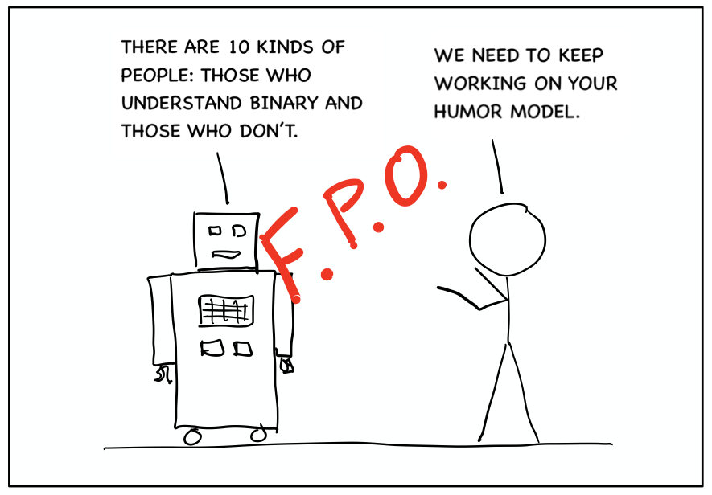

```{r setup, include=FALSE}
knitr::opts_chunk$set(echo = TRUE)
```



See the brief video below for an overview of why we've created this site and how we recommend using it:

<div style="padding-top:15px; text-align: center;"><iframe width="848" height="477" src="https://www.youtube.com/embed/jeKJp16nC30?controls=0" frameborder="0" allow="accelerometer; autoplay; encrypted-media; gyroscope; picture-in-picture" allowfullscreen></iframe></div>