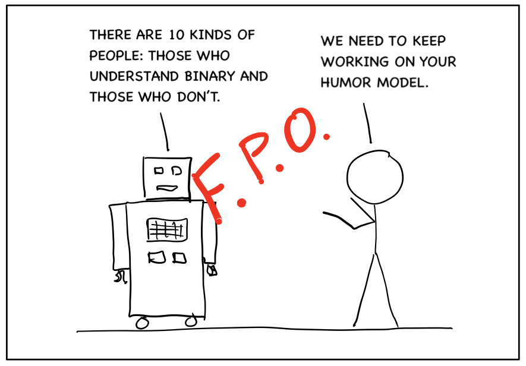

```{r setup, include=FALSE}
knitr::opts_chunk$set(echo = TRUE)
```



Lorem ipsum dolor sit amet, consectetur adipiscing elit, sed do eiusmod tempor incididunt ut labore et dolore magna aliqua. Blandit volutpat maecenas volutpat blandit aliquam etiam erat velit scelerisque. At imperdiet dui accumsan sit amet. Eu non diam phasellus vestibulum lorem sed. Nibh ipsum consequat nisl vel pretium lectus quam id leo. Viverra mauris in aliquam sem fringilla ut. Arcu cursus euismod quis viverra nibh cras pulvinar mattis nunc. Auctor elit sed vulputate mi sit amet mauris. Volutpat lacus laoreet non curabitur gravida arcu ac tortor dignissim. A diam maecenas sed enim ut sem viverra. Nunc consequat interdum varius sit amet mattis. Sollicitudin nibh sit amet commodo nulla facilisi nullam. Nunc mattis enim ut tellus elementum sagittis vitae. Sed nisi lacus sed viverra. Nullam vehicula ipsum a arcu cursus. Vel turpis nunc eget lorem dolor sed viverra.