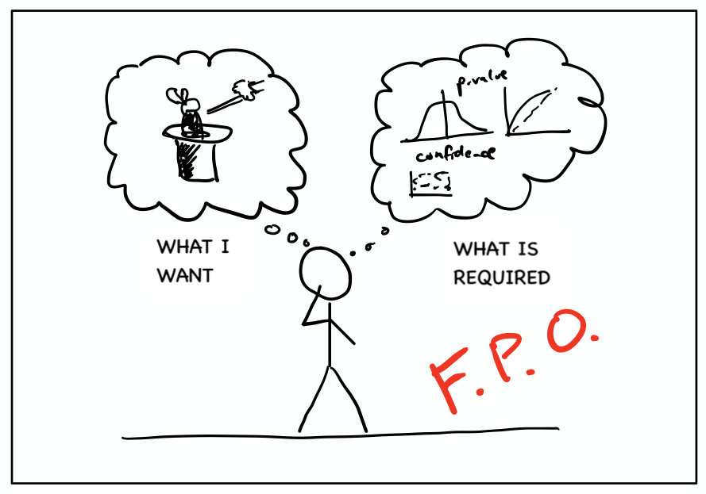

```{r setup, include=FALSE}
knitr::opts_chunk$set(echo = TRUE)
```



Data science is a hot topic, and marketers are being bombarded with messages that data scientists are magicians who can wave their wands at a massive database and generate. It's easy to get swept up in the hype and wind up in one of two places:

* Thinking that data science and machine learning and AI are going to automatically and powerfully arrive in the form of a magic black box.
* Getting terrified that data science and machine learning and AI are incredibly confusing, scary, and impossible to put to use without returning to school for 4-5 years

Neither of these perceptions is correct. The reality is in the middle. In the video below, we walk through some of the key barriers that keep business stakeholders from effectively embracing the advanced analytics that they know they should be, including:

* The deep historical roots of modern probability theory, and how marketers have been shielded from that theory and related concepts (and why that is problematic).
* How and why technology platforms overemphasize the "technology" side of what is a **technology + strategic thought + statistical interpretation** problem.
* How marketers have been conditioned to work with _aggregated_ data (dimensions and metrics) rather than truly _detailed_ data (and why that matters)
* The concept of "features" and "feature engineering" -- why simply pushing raw data into a machine learning platform actually misses a critical step (That _requires_ human thought!)

<div style="padding-top:15px; text-align: center;"><iframe width="848" height="477" src="https://www.youtube.com/embed/08ZrnbP4OnE" frameborder="0" allow="accelerometer; autoplay; encrypted-media; gyroscope; picture-in-picture" allowfullscreen></iframe></div>
